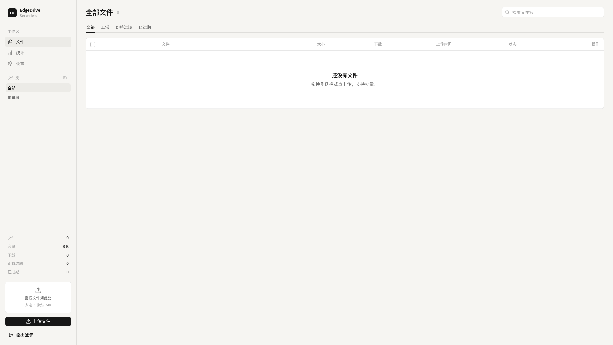
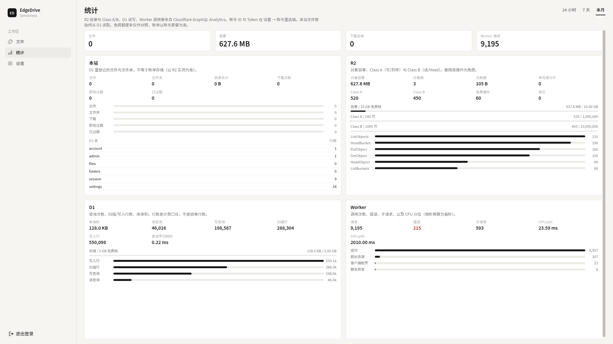
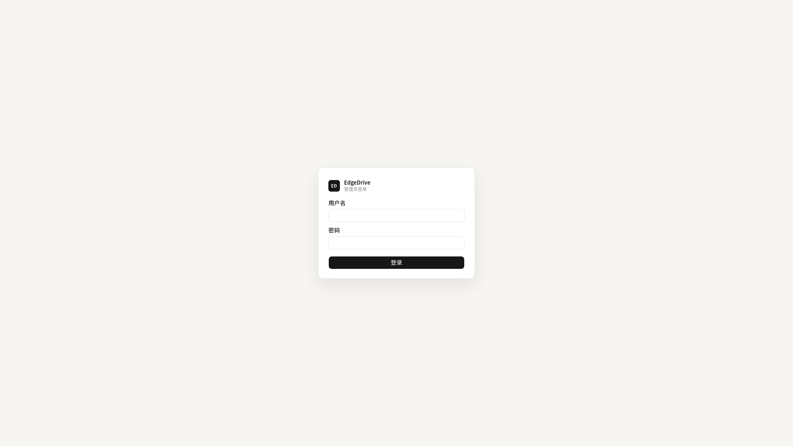

# EdgeDrive

跑在 **Cloudflare Workers 边缘网络**上的 **Serverless 文件服务**：没有常驻服务器，按请求在就近节点执行。后台上传、设有效期、按文件夹整理；过期后下载返回 410。

**EdgeDrive = 一套完整的私人文件托管 + 临时直链服务**：R2 存文件、D1 管元数据、Better-Auth 管身份、Cloudflare Access 可选加固——全部跑在 Cloudflare 免费层上。

---

## 特性

- **Serverless**：无服务器、免运维、全球边缘节点就近响应
- **后台上传**：拖拽 / 批量 / 分片（>8MB 自动分片，大文件无上限）
- **文件夹**：树形目录、新建 / 重命名 / 删除 / 批量移动
- **有效期**：行内三档（小时 / 天数 / 永久）+ 批量设置 + 过期自动 410
- **预览落地页**：`/dl/<路径>/view` —— 图片 / 音视频 / PDF 在线预览
- **Range 下载**：支持断点续传 / 视频拖动播放
- **统计仪表盘**：R2 容量与 Class A/B、D1 读写、Worker 调用量（GraphQL Analytics）—— 响应式一屏展示
- **安全**：路径穿越多层防护、XSS 内容类型硬化、SQL 全参数化、Better-Auth 会话、Access JWT 真实验证
- **一键部署**：Fork → 导入 Cloudflare → 自动建 D1/R2/跑迁移 → 首次访问创建管理员

---

## 截图（桌面端）

| 管理台 · 文件 | 用量统计 | 登录 / 首次设置 |
|---|---|---|
|  |  |  |

---

## 快速部署（约 5 分钟）

### 前置

- 一个 [Cloudflare](https://dash.cloudflare.com) 账号（免费即可）
- 一个 GitHub 账号

### 步骤

1. **Fork 本仓库**（GitHub → Fork）

2. **导入 Cloudflare**：
   - 登录 Cloudflare 面板 → **Workers & Pages** → **Create** → **Pages** → **Connect to Git**
   - 选你 fork 的仓库 → **Begin setup**
   - 框架预设：`Next.js`；构建命令 `npm run build`；输出目录留空
   - **Save and Deploy** —— 首次部署会自动创建：
     - D1 数据库（`edgedrive-db`）+ 自动跑迁移建表
     - R2 存储桶（`edgedrive`）
     - Worker 绑定（`DB` / `R2`）

3. **首次访问创建管理员**：
   - 打开部署后给你的 `*.workers.dev` 域名
   - 访问 `/admin` → 会跳转首次设置页 → 填**用户名 + 密码（≥8 位）** → 创建完成
   - 管理员账号存 D1，**不需要配置任何 Secrets**

4. **部署更新**：push 到 main 即自动重新部署（Cloudflare Pages Git 集成）

> 可选：绑定自定义域名（Workers & Pages → 你的项目 → Custom domains）—— 直链会变成 `https://你的域名/dl/...`

---

## 使用

### 上传

- 拖拽文件到侧边栏上传区，或点选文件（支持多选）
- 文件 >8MB 自动走分片上传（8MB/片、4 并发、失败重试）—— 大小无上限
- 上传时可选目标文件夹

### 有效期

- 行内「调整有效期」：`1h` / `6h` / `24h` / `7d` / `30d` / **永久** / 自定义
- 批量勾选 → 批量设过期 / 转永久 / 立即过期
- 文件过期后：`/dl` 下载返回 **410 Gone**；物理删除由 purge 任务（每日 04:00 UTC）执行

### 直链

- 下载：`/dl/<路径>/<文件名>`（强制 attachment 下载）
- 预览：`/dl/<路径>/<文件名>/view`（图片 / 音视频 / PDF）
- 支持 `Range` 头（断点续传、视频拖动）

### 统计

- 管理台 → 统计：R2 容量与操作数、D1 读写与行数、Worker 请求与错误（来自 GraphQL Analytics）
- 在 **设置 → 账号** 里填 Cloudflare 账号 ID 与 API Token 后启用（Token 只需 `Account Analytics Read` 权限）
- 免费额度条仅作对照，账单以账号套餐为准

---

## Cloudflare Access 配置（可选加固）

EdgeDrive 支持两种认证模式（设置 → 认证）：

| 模式 | 说明 |
|---|---|
| **password**（默认）| Better-Auth 用户名密码登录，开箱即用 |
| **access** | 由 Cloudflare Access 接管认证——Worker 验证 Access JWT（签名 / issuer / audience）|

> Access 模式下**密码登录失效**，只有通过 Cloudflare Access 验证的请求才能访问管理台。
> 切换前必须完成下面两步——否则站点会拒绝切换（防锁死保护）。

### 第 1 步：创建 Access Application

1. Cloudflare 面板 → **Zero Trust** → **Access → Applications** → **Add an application**
2. 类型选 **Self-hosted**；Application domain 填你的域名/admin*（如 `edgedrive.example.com/admin*` 或 `*.workers.dev/admin*`）
3. Policy：配置允许访问的成员（如你的邮箱 / 组织）
4. 创建完成后，在 Application 详情页（Overview）找到 **Application Audience (AUD) Tag** —— 一串 UUID，记下来

### 第 2 步：配置 Worker 环境变量（必须）

给 Worker 配两个环境变量（Workers & Pages → 你的项目 → **Settings → Variables**）：

| 变量 | 值 |
|---|---|
| `CF_ACCESS_TEAM` | 你的 Zero Trust 团队名（Zero Trust 首页右上角，如 `zuens2020`）|
| `CF_ACCESS_AUD` | 第 1 步拿到的 Application AUD Tag（UUID）|

### 第 3 步：切换认证模式

1. 管理台 → **设置 → 认证** → 选择 `access` → 保存
2. 保存时如果 `CF_ACCESS_TEAM` / `CF_ACCESS_AUD` 未配置，会返回错误 `access-mode-needs-env`（按第 2 步配好再切）
3. 切换后：访问 `/admin` 会被 Cloudflare Access 拦截 → 登录后带 JWT 放行 → Worker 验签通过 → 进入管理台

> ⚠️ **切换前确认 Access 策略已生效**——先在一个浏览器窗口测试 Access 登录正常，再切换模式，避免把自己锁在门外。
> 回退：在 CF 面板临时关掉 Access Application（或直接改回 password 模式——需要先恢复 Access 可访问）。

---

## 环境变量 / Secrets

| 名称 | 类型 | 必需 | 说明 |
|---|---|---|---|
| `CF_ACCESS_TEAM` | 变量 | access 模式必需 | Zero Trust 团队名 |
| `CF_ACCESS_AUD` | 变量 | access 模式必需 | Access Application AUD |
| `CF_API_TOKEN` | Secret | 可选 | 启用用量统计时用（优先于设置页填写的 Token）|
| `BETTER_AUTH_SECRET` | Secret | 可选 | 密码模式会话密钥（不配则自动生成存 D1）|
| `AUTH_MODE` | 变量 | 可选 | `password`（默认）/ `access` —— 也可在设置页切换 |

> 管理员账号、站点配置、cron 令牌默认全部存在 D1 —— 无需配置即可部署。

---

## 本机开发（可选）

```bash
npm install
npx wrangler d1 create edgedrive-db   # 建本地 D1（或按 README 部署流程自动建）
npm run dev
```

需要 `wrangler.jsonc` 里的绑定（D1 / R2）可用。类型检查：`npm run typecheck`；测试：`npm test`。

---

## 测试

```bash
npm test        # Vitest：sanitize / JWT 验证 / 有效期 / 认证边界 / LIKE 转义 等 45+ 用例
npm run typecheck
```

GitHub Actions 会在每次 push 时自动跑测试 + 类型检查。

---

## 技术栈

- [Next.js 16](https://nextjs.org)（App Router）+ [OpenNext](https://opennext.js.org) → Cloudflare Workers
- [Cloudflare D1](https://developers.cloudflare.com/d1/)（SQLite 元数据 + 配置）
- [Cloudflare R2](https://developers.cloudflare.com/r2/)（对象存储，免费 10GB + 零出口流量费）
- [Better-Auth](https://www.better-auth.com)（会话认证）
- Cloudflare Access（可选加固）
- Vitest（测试）

## License

[MIT](LICENSE)
