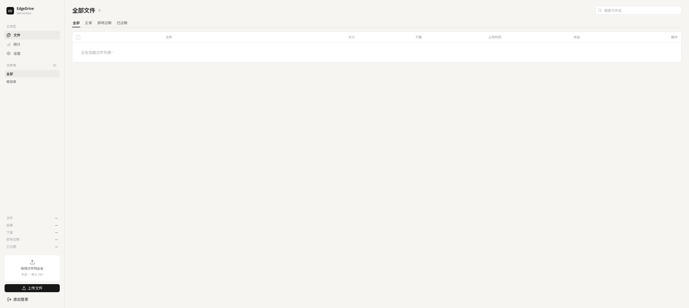
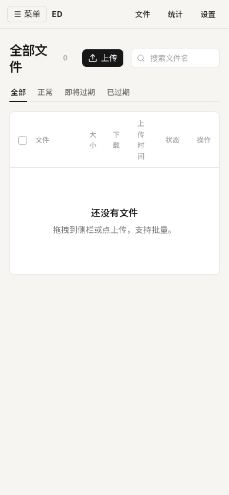

# EdgeDrive

跑在 **Cloudflare Workers 边缘网络**上的 **Serverless** 文件服务：没有常驻服务器，按请求在就近节点执行。后台上传、设有效期、按文件夹整理；过期后下载返回 410。

公开侧：

- `/dl/文件路径` 下载
- `/dl/文件路径/view` 落地页（图片、音视频、PDF 可预览）
- 过期后返回 410

管理台可改标记颜色、分页和默认有效期。产品名固定为 **EdgeDrive**。管理员账号和站点配置存在 D1，不用去 Worker 的 Variables and Secrets 里填。

## 截图

| 管理台（桌面） | 落地页（登录） | 管理台（手机） |
|---|---|---|
|  |  |  |

---

## 部署

需要：Cloudflare 账号、本仓库的 Git 权限。线上用 Cloudflare 绑定仓库自动部署。GitHub Actions 只跑 `npm test` 和 `tsc`，不负责发布。

不要在 `wrangler.jsonc` 里填数据库 ID 或桶名。代码里的绑定名必须是 **DB**（D1）和 **FILES**（R2）。

本机或自定义流水线请用 **`npm run deploy`**（`scripts/cf-deploy.mjs`）：编 OpenNext、绑缺失的 D1/R2、跑远程迁移。Cloudflare 创建页若只填构建命令、部署固定为 `npx wrangler deploy`，`postinstall` 会包装 `node_modules/wrangler` 的 CLI，把这次 deploy 转进同一套脚本。这是有意的 hack：wrangler 改 CLI 路径时 **postinstall 会报错退出**，不要静默跳过；此时改用 `npm run deploy`，或更新 `scripts/install-wrangler-shim.mjs`。

- **新 Worker**：第一次部署时还没有 Bindings，wrangler 会自动建一套 D1 和 R2 并绑上（名称类似 `edgedrive-db`、`edgedrive-files`）。
- **已经绑过**：Settings → Bindings 里已有 `DB` / `FILES` 时，部署会沿用，不会另建。

### 1. Fork 或导入本仓库

把代码放到你自己的 GitHub / GitLab 上，后面 Cloudflare 要连这个仓库。

### 2. 在 Cloudflare 里接上仓库

1. 打开 [Workers & Pages](https://dash.cloudflare.com/?to=/:account/workers-and-pages)
2. **Create** → **Import a repository**，选第 1 步的仓库  
   如果 Worker 已经建好：点进该 Worker → **Settings** → **Build** → **Connect**
3. Worker 名称保持和仓库里的一致（默认 `edgedrive`）。若要换名，同时改 `wrangler.jsonc` 的 `name`
4. 生产分支选 `main`
5. 创建页通常**只让填构建命令**。填 `npm run build`（默认即可），部署命令不用填。Cloudflare 会自己跑 `npx wrangler deploy`；仓库会拦住这次部署：没有绑定就自动建 D1/R2，然后跑数据库迁移。
6. **Save and Deploy** / **部署**。

### 3. 想用已有的 D1 / R2（可选）

若账号里已经有库和桶，不想用自动建的那套：导入仓库后、第一次部署前，打开该 Worker → **Settings → Bindings**：

1. 添加 D1，变量名填 `DB`，下拉选已有数据库
2. 添加 R2，变量名填 `FILES`，下拉选已有桶

之后部署会沿用这里选的资源。若已经自动建过一套，把 Bindings 改成你的库/桶再部署即可。

### 4. 自定义域名（可选）

该 Worker → **Settings** → **Domains & Routes** → 绑你的域名。

### 5. 登录使用

打开站点首页，点「进入后台」（或直接访问 `/admin`）。第一次会让你创建管理员，之后用这个账号登录。密码存在 D1，改密请进管理台。以前部署时留在 Worker Variables / Secrets 里的账密和 Token 可以删掉，程序不再读取。

若管理入口改由 Cloudflare Access 保护：登录后台 → 设置 → 账号，把登录方式改成 Access。GitHub / Google 等 OAuth 在 Access 里配。

之后可以：上传文件、设有效期、建文件夹、改标记颜色。下载路径是 `/dl/文件夹/文件名`。

统计页默认只显示本站数据。若要看 R2 / 数据库用量，需要 Account ID 和 API Token（Account Analytics 读权限）。Token 两种模式：

- **D1（方便）**：公开 fork、只想在管理台填一次。Token 存在 D1 `settings`。适合快速部署；库被读出则 Token 也会暴露。
- **Worker Secret（推荐）**：Dashboard → Worker → Settings → Variables and Secrets，添加加密变量 **`CF_API_TOKEN`**。运行时优先读 Secret，未配才回退 D1。Account ID 仍可在管理台填写。

账号里有多套 Worker / R2 / D1 时，再填 Worker 名、桶名、D1 ID 用来过滤，不是绑定本身。

过期文件由 **Cron Trigger** 每天 **04:00 UTC** 自动清理：Worker 会 `GET /api/cron/purge`，`Authorization: Bearer <cron_secret>`。外部定时器也可 GET 或 POST 同一地址。令牌在管理台 → 账号里轮换。第一次部署后访问一次后台会写入 `cron_secret`。

---

## 本机开发（可选）

```bash
npm ci
npm run db:migrate:local
npm run dev
```

打开 http://localhost:3000 ，第一次访问后台时创建管理员。
